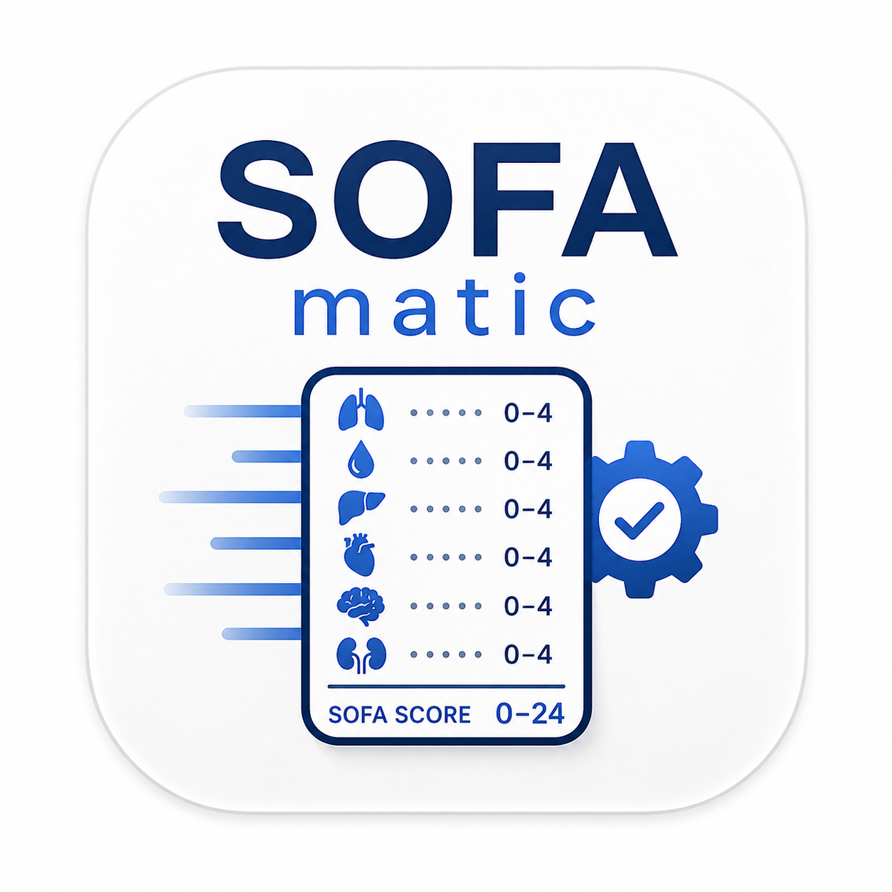

# sofamatic <a href="https://ksa98.github.io/sofamatic/"></a>

> *Automatic SOFA scoring for R.*

<!-- badges: start -->
[](https://github.com/ksa98/sofamatic/actions/workflows/R-CMD-check.yaml)
[](https://github.com/ksa98/sofamatic/actions/workflows/pkgdown.yaml)
[](https://app.codecov.io/gh/ksa98/sofamatic?branch=main)
[](https://CRAN.R-project.org/package=sofamatic)
[](https://lifecycle.r-lib.org/articles/stages.html#stable)
[](https://www.r-project.org/)
[](https://opensource.org/licenses/BSD-4-Clause)
[](https://github.com/ksa98/sofamatic/commits/main)
[](https://github.com/ksa98/sofamatic/issues)
<!-- badges: end -->

**sofamatic** is a small, dependency-light R package that computes the
**Sequential Organ Failure Assessment (SOFA)** score and its six
sub-scores from clinical data. It works on both cross-sectional snapshots
and longitudinal (one-row-per-day) layouts, and supports SI as well as
conventional units. Thresholds follow Vincent et al. (1996).

## Highlights

- Six vectorised component scorers (`score_respiratory()`,
  `score_coagulation()`, `score_liver()`, `score_cardiovascular()`,
  `score_neurological()`, `score_renal()`) plus a single-call
  aggregator `calculate_sofa()`.
- Cross-sectional and longitudinal layouts; longitudinal mode adds
  `SOFA_admission` and `SOFA_max` per subject in the same call.
- SI and conventional units for PaO2/FiO2, bilirubin, and creatinine.
- Configurable handling of missing GCS in sedated vs non-sedated
  patients, and two strategies for aggregating missing sub-scores.
- Base-R only at runtime — no extra dependencies in regulated or
  air-gapped environments.

## Installation

The package is not yet on CRAN. Install the development version from
GitHub:

```r
# install.packages("remotes")
remotes::install_github("ksa98/sofamatic")
```

## Quick start

```r
library(sofamatic)

df  <- example_sofa_data(n_subjects = 5, days_each = 4)
out <- calculate_sofa(df, id = "subject_id", time = "day")

head(out[, c("subject_id", "day",
             "SOFA_resp", "SOFA_coag", "SOFA_liver",
             "SOFA_cardio", "SOFA_neuro", "SOFA_renal",
             "SOFA_score", "SOFA_admission", "SOFA_max")])
```

## What you get

| Function                  | What it scores                                  |
|---------------------------|-------------------------------------------------|
| `score_respiratory()`     | PaO2/FiO2 (kPa or mmHg), with ventilation flag  |
| `score_coagulation()`     | Platelet count                                  |
| `score_liver()`           | Bilirubin (µmol/L or mg/dL)                     |
| `score_cardiovascular()`  | MAP plus dopamine / dobutamine / NE / E doses   |
| `score_neurological()`    | GCS, with optional sedation handling            |
| `score_renal()`           | Creatinine (µmol/L or mg/dL), urine, dialysis   |
| `calculate_sofa()`        | All of the above + total + longitudinal helpers |

Every component returns an integer vector in `{0, 1, 2, 3, 4}` (or
`NA`). `calculate_sofa()` returns the input data frame augmented with
one column per sub-score, the total `SOFA_score`, and (when
`id`/`time` are supplied) `SOFA_admission` and `SOFA_max` per subject.

## Cross-sectional vs longitudinal

```r
# Cross-sectional: one row per patient
calculate_sofa(df_xs)

# Longitudinal: one row per (patient, day)
calculate_sofa(df_long, id = "subject_id", time = "day")
```

## Custom column names

Defaults match the parameter names (`pao2_fio2`, `platelets`,
`bilirubin`, `map`, `gcs`, `creatinine`, `urine_output`, …). Override
any of them to match your dataset:

```r
calculate_sofa(
  df,
  pao2_fio2 = "pf_ratio",
  platelets = "plt",
  bilirubin = "tot_bili_mgdl",
  units_bilirubin  = "mg/dL",
  units_creatinine = "mg/dL",
  units_pao2_fio2  = "mmHg"
)
```

Pass `NULL` for any optional column you don't have. For example, if
your dataset has no urine output and no dialysis flag, the renal
sub-score is derived from creatinine alone:

```r
calculate_sofa(df, urine_output = NULL, dialysis = NULL)
```

## Handling missing data

Two policies for the total score:

* `na_strategy = "sum_na_zero"` *(default)* — missing sub-scores
  contribute 0 to the total. Useful when only some components are
  unmeasured.
* `na_strategy = "propagate"` — any missing sub-score yields an `NA`
  total.

For the neurological sub-score, `score_neurological()` accepts a
`sedation` flag. A missing GCS in a non-sedated patient is treated as
"alert" (score 0); a missing GCS in a sedated patient is treated as
moderate impairment (score 2). Override with `na_strategy` if you want
different behaviour.

## Synthetic example data

`example_sofa_data(n_subjects, days_each, seed)` returns a longitudinal,
ICU-style data frame with one row per (subject, day) and the columns
expected by `calculate_sofa()`. Values are drawn from a simple
parametric generator:

* **Per-subject statics** are drawn once and broadcast over the
  subject's days: `age ~ Normal(62, 12)`, sex sampled with `P(M) = 0.6`,
  `bmi ~ Normal(27, 5)`.
* **Per-row flags** are independent Bernoullis: ventilation
  `P = 0.85`, sedation `P = 0.55`, vasopressor use `P = 0.40`,
  dialysis `P = 0.08`.
* **Conditional measurements** depend on those flags. PaO2/FiO2
  (kPa) is drawn from `Normal(25, 8)` for ventilated rows and
  `Normal(50, 8)` otherwise (floored at 5). MAP is drawn from
  `Normal(70, 10)` on vasopressors and `Normal(80, 10)` off them.
  Norepinephrine dose is `Normal(0.06, 0.05)` µg/kg/min on
  vasopressor rows (floored at 0.001) and exactly 0 elsewhere.
* **Independent measurements** use floored Normals: platelets
  `Normal(180, 70)`, bilirubin `Normal(25, 25)`, creatinine
  `Normal(110, 60)`, urine output `Normal(1500, 600)`.
* **GCS** is sampled uniformly on 3–15, with roughly a quarter of
  sedated rows blanked to `NA` to mirror the real-world pattern of
  un-recorded GCS in fully sedated patients.

A `seed` argument is exposed (default `42`) so output is reproducible.
The generator is deliberately simple: distributions are independent,
day-to-day values are not autocorrelated, and the parameters are
illustrative rather than derived from any specific cohort. Use the
data for examples, tests, and benchmarks — not for clinical inference.

## Documentation

Full reference and articles are published at
<https://ksa98.github.io/sofamatic/>:

* **[Introduction](https://ksa98.github.io/sofamatic/articles/sofamatic-introduction.html)**
  — package tour, single-component scoring, longitudinal mode.
* **[Case study: SOFA in a synthetic ICU cohort](https://ksa98.github.io/sofamatic/articles/case-study-icu-cohort.html)**
  — a worked applied analysis from raw data to deterioration metrics.
* **[Edge cases and limits](https://ksa98.github.io/sofamatic/articles/edge-cases-and-limits.html)**
  — boundary arithmetic, unit-conversion gotchas, missing-data
  policies, and a defensive scoring wrapper.
* **[FAQ](https://ksa98.github.io/sofamatic/articles/faq.html)**
  — short answers to recurring questions.

## Contributing

Bug reports, feature requests, and pull requests are welcome. Please
read [`CONTRIBUTING.md`](CONTRIBUTING.md) for the workflow, and open
issues at
<https://github.com/ksa98/sofamatic/issues>. Issue templates
for bugs and feature requests are provided.

## Citation

```r
citation("sofamatic")
```

The repository also includes a [`CITATION.cff`](CITATION.cff) file,
which GitHub uses to render a *Cite this repository* button on the
project page.

## References

Vincent, J. L., Moreno, R., Takala, J., Willatts, S., De Mendonça, A.,
Bruining, H., … Thijs, L. G. (1996). The SOFA (Sepsis-related Organ
Failure Assessment) score to describe organ dysfunction/failure.
*Intensive Care Medicine*, **22**(7), 707–710.
<https://doi.org/10.1007/BF01709751>

## License

BSD 4-Clause "Original" or "Old" License © 2024 Keano Samaritakis. See
[LICENSE](LICENSE).
