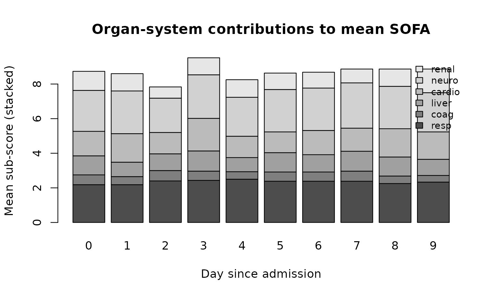
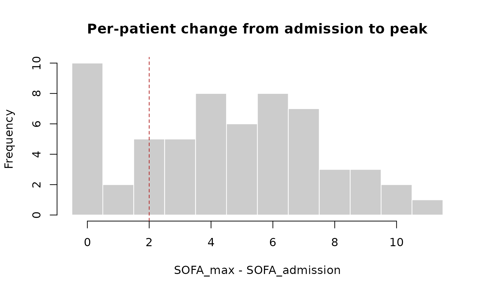

# Case study: SOFA in a synthetic ICU cohort

This article walks through a typical analysis you might run on an ICU
cohort once SOFA scores are computed: cohort-level summaries, day-by-day
trajectories, sub-score contributions, and a quick face-validity check
against the underlying clinical features. The dataset is the synthetic
one shipped with the package — no real patients — so the numbers
illustrate the workflow only.

Everything below uses base R plus `sofamatic`. No additional packages
are required.

``` r
library(sofamatic)
set.seed(7)
```

## A worked cohort

Generate a slightly larger cohort than the README example: 60 subjects,
10 days each, in long format.

``` r
cohort <- example_sofa_data(n_subjects = 60, days_each = 10)
dim(cohort)
#> [1] 600  17
head(cohort, 3)
#>   subject_id day age sex bmi pao2_fio2 ventilated platelets bilirubin
#> 1          1   0  78   M  34      12.1          1        91        39
#> 2          1   1  78   M  34       9.4          1       215        28
#> 3          1   2  78   M  34      22.3          1       170        52
#>   vasopressors noradrenaline  map sedation gcs creatinine urine_output dialysis
#> 1            1         0.034 52.9        1  NA        106         1177        0
#> 2            0         0.000 93.8        1   9         54          889        0
#> 3            0         0.000 74.6        1   3         20          163        0
```

Compute every sub-score, the total `SOFA_score`, plus the longitudinal
helpers `SOFA_admission` and `SOFA_max` in a single call.

``` r
scored <- calculate_sofa(cohort, id = "subject_id", time = "day")

scored[scored$subject_id == 1,
       c("day", "SOFA_resp", "SOFA_coag", "SOFA_liver",
         "SOFA_cardio", "SOFA_neuro", "SOFA_renal",
         "SOFA_score", "SOFA_admission", "SOFA_max")]
#>    day SOFA_resp SOFA_coag SOFA_liver SOFA_cardio SOFA_neuro SOFA_renal
#> 1    0         4         2          2           3          2          0
#> 2    1         4         0          1           0          3          0
#> 3    2         3         0          2           0          4          4
#> 4    3         3         0          2           0          2          1
#> 5    4         0         0          0           0          4          4
#> 6    5         0         0          2           0          2          1
#> 7    6         2         2          2           0          2          2
#> 8    7         2         0          0           0          3          0
#> 9    8         3         0          1           3          4          0
#> 10   9         3         0          0           0          1          1
#>    SOFA_score SOFA_admission SOFA_max
#> 1          13             13       13
#> 2           8             13       13
#> 3          13             13       13
#> 4           8             13       13
#> 5           8             13       13
#> 6           5             13       13
#> 7          10             13       13
#> 8           5             13       13
#> 9          11             13       13
#> 10          5             13       13
```

Three views ship out the door for free:

- row-level sub-scores and total (`SOFA_resp` … `SOFA_score`),
- per-subject admission score (`SOFA_admission`, constant within
  `subject_id`),
- per-subject worst score during follow-up (`SOFA_max`).

## The cohort at admission

What does organ failure look like on day 0?

``` r
admission <- scored[scored$day == 0, ]

barplot(table(factor(admission$SOFA_score,
                     levels = 0:max(admission$SOFA_score))),
        col  = "grey70", border = NA,
        xlab = "SOFA score on admission",
        ylab = "Number of patients",
        main = "Distribution of admission SOFA")
```


A common cohort summary is the prevalence of organ failure per system,
defined as a sub-score ≥ 3:

``` r
parts <- c("SOFA_resp", "SOFA_coag", "SOFA_liver",
           "SOFA_cardio", "SOFA_neuro", "SOFA_renal")

prevalence <- sapply(parts, function(p) mean(admission[[p]] >= 3))
round(sort(prevalence, decreasing = TRUE), 2)
#>   SOFA_resp SOFA_cardio  SOFA_neuro  SOFA_renal   SOFA_coag  SOFA_liver 
#>        0.43        0.40        0.40        0.15        0.07        0.00
```

## Trajectories over the first 10 days

Mean and inter-quartile band of `SOFA_score` by day:

``` r
by_day <- aggregate(SOFA_score ~ day, scored, FUN = function(x) {
  c(mean = mean(x),
    q25  = unname(quantile(x, 0.25)),
    q75  = unname(quantile(x, 0.75)))
})
by_day <- do.call(data.frame, by_day)
names(by_day) <- c("day", "mean", "q25", "q75")

plot(by_day$day, by_day$mean, type = "n",
     ylim = range(c(by_day$q25, by_day$q75)),
     xlab = "Day since admission",
     ylab = "SOFA score",
     main = "Mean SOFA across the cohort (band = IQR)")
polygon(c(by_day$day, rev(by_day$day)),
        c(by_day$q25, rev(by_day$q75)),
        col = adjustcolor("steelblue", alpha.f = 0.2), border = NA)
lines(by_day$day, by_day$mean, col = "steelblue", lwd = 2)
points(by_day$day, by_day$mean, col = "steelblue", pch = 19)
```


A spaghetti plot of individual trajectories shows how heterogeneous the
cohort is at the patient level:

``` r
plot(NA, xlim = range(scored$day),
     ylim = c(0, max(scored$SOFA_score)),
     xlab = "Day since admission",
     ylab = "SOFA score",
     main = "Per-patient SOFA trajectories")
for (sid in unique(scored$subject_id)) {
  s <- scored[scored$subject_id == sid, ]
  s <- s[order(s$day), ]
  lines(s$day, s$SOFA_score,
        col = adjustcolor("black", alpha.f = 0.25))
}
```


## Which organ systems drive the score?

Mean of each sub-score by day, stacked:

``` r
mean_parts <- sapply(parts, function(p)
  tapply(scored[[p]], scored$day, mean, na.rm = TRUE))

barplot(t(mean_parts),
        col          = grey.colors(length(parts), start = 0.3, end = 0.9),
        legend.text  = sub("SOFA_", "", parts),
        args.legend  = list(x = "topright", bty = "n", cex = 0.8),
        xlab         = "Day since admission",
        ylab         = "Mean sub-score (stacked)",
        main         = "Organ-system contributions to mean SOFA")
```



In this synthetic cohort the respiratory and cardiovascular components
dominate, which is consistent with how the underlying generator was
calibrated (heavy ventilation prevalence, frequent vasopressor use).

## Worsening vs. recovery

Many studies define ICU deterioration as
`SOFA_max − SOFA_admission ≥ 2`. Because
[`calculate_sofa()`](https://ksa98.github.io/sofamatic/reference/calculate_sofa.md)
returns both numbers per row, the calculation is one line.

``` r
per_subject <- scored[!duplicated(scored$subject_id),
                      c("subject_id", "SOFA_admission", "SOFA_max")]
per_subject$delta_SOFA <- per_subject$SOFA_max - per_subject$SOFA_admission

table(deteriorated_2plus = per_subject$delta_SOFA >= 2)
#> deteriorated_2plus
#> FALSE  TRUE 
#>    12    48

hist(per_subject$delta_SOFA,
     breaks = seq(-0.5, max(per_subject$delta_SOFA) + 0.5, by = 1),
     col = "grey80", border = "white",
     xlab = "SOFA_max - SOFA_admission",
     main = "Per-patient change from admission to peak")
abline(v = 2, lty = 2, col = "firebrick")
```



## Face-validity checks

Two quick sanity checks tying sub-scores back to their clinical inputs.
The respiratory sub-score should be higher in ventilated rows; the
cardiovascular sub-score should be higher in rows on vasopressors.

``` r
op <- par(mfrow = c(1, 2))
boxplot(SOFA_resp ~ ventilated, data = scored,
        names = c("not vent.", "ventilated"),
        ylab  = "Respiratory SOFA",
        main  = "Resp. SOFA by ventilation")
boxplot(SOFA_cardio ~ vasopressors, data = scored,
        names = c("no pressors", "on pressors"),
        ylab  = "Cardiovascular SOFA",
        main  = "Cardio. SOFA by vasopressor use")
```


``` r
par(op)
```

Both shifts go in the expected direction — a useful smoke test you can
copy onto your own data after wiring up the column-name mapping.

## Bringing your own data

Real datasets rarely come with the package’s default column names or
units. Override any of them at the call site. The example below uses
mmHg for PaO2/FiO2 and mg/dL for bilirubin and creatinine, with custom
column names throughout.

``` r
my_data <- data.frame(
  pid       = c("A", "B", "C"),
  pf_ratio  = c(420, 220, 95),
  is_vent   = c(0, 1, 1),
  plt       = c(180, 60, 22),
  bili_mgdl = c(0.7, 3.2, 8.0),
  pressors  = c(0, 1, 1),
  ne_dose   = c(0, 0.06, 0.25),
  map_mmhg  = c(82, 68, 58),
  on_sed    = c(0, 1, 1),
  gcs       = c(15, NA, 5),
  cr_mgdl   = c(0.9, 1.6, 3.4),
  uo_24h    = c(2200, 900, 250),
  rrt       = c(0, 0, 1)
)

calculate_sofa(
  my_data,
  pao2_fio2     = "pf_ratio",   units_pao2_fio2  = "mmHg",
  ventilated    = "is_vent",
  platelets     = "plt",
  bilirubin     = "bili_mgdl",  units_bilirubin  = "mg/dL",
  vasopressors  = "pressors",
  noradrenaline = "ne_dose",
  map           = "map_mmhg",
  sedation      = "on_sed",
  gcs           = "gcs",
  creatinine    = "cr_mgdl",    units_creatinine = "mg/dL",
  urine_output  = "uo_24h",
  dialysis      = "rrt"
)[, c("pid", "SOFA_resp", "SOFA_coag", "SOFA_liver",
      "SOFA_cardio", "SOFA_neuro", "SOFA_renal", "SOFA_score")]
#>   pid SOFA_resp SOFA_coag SOFA_liver SOFA_cardio SOFA_neuro SOFA_renal
#> 1   A         0         0          0           0          0          0
#> 2   B         2         2          2           3          2          1
#> 3   C         4         3          3           4          4          4
#>   SOFA_score
#> 1          0
#> 2         12
#> 3         22
```

If a variable is unmeasured in your dataset, pass `NULL` for it. With
`na_strategy = "sum_na_zero"` (the default) the missing component
contributes 0 to the total; with `na_strategy = "propagate"` the total
becomes `NA` whenever any sub-score is missing.

``` r
no_urine <- my_data
no_urine$uo_24h <- NA

calculate_sofa(no_urine,
               pao2_fio2     = "pf_ratio",   units_pao2_fio2  = "mmHg",
               ventilated    = "is_vent",
               platelets     = "plt",
               bilirubin     = "bili_mgdl",  units_bilirubin  = "mg/dL",
               vasopressors  = "pressors",
               noradrenaline = "ne_dose",
               map           = "map_mmhg",
               sedation      = "on_sed",
               creatinine    = "cr_mgdl",    units_creatinine = "mg/dL",
               urine_output  = "uo_24h",
               dialysis      = "rrt",
               na_strategy   = "propagate")[, c("pid", "SOFA_score")]
#>   pid SOFA_score
#> 1   A          0
#> 2   B         12
#> 3   C         22
```

## Caveats

The cohort used here is synthetic. Distributions are loosely calibrated
to look plausible on an adult ICU service, but the data are not suitable
for any clinical inference — they exist only to demonstrate the package
API and the shape of analyses it enables. Replicate this notebook
against your own dataset and the patterns will tell you something
meaningful; replicate it against
[`example_sofa_data()`](https://ksa98.github.io/sofamatic/reference/example_sofa_data.md)
and the patterns tell you only about the generator.
